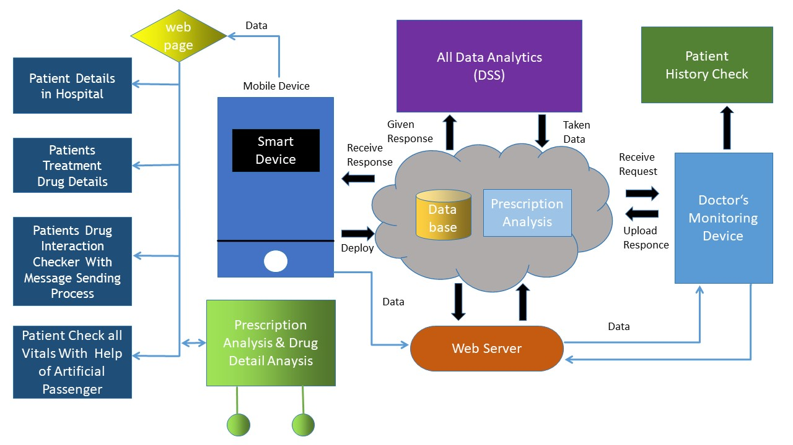
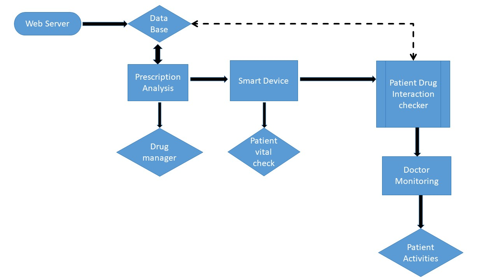

# Prescription Analysis 🩺💊

This project analyzes handwritten prescriptions using machine learning and OCR (Optical Character Recognition) techniques.  
It provides a web interface for users to upload prescription images and get analyzed results.

---
<div style="display: flex; justify-content: center; flex-wrap: wrap; gap: 10px;">

  

</div>

<div style="display: flex; justify-content: center; flex-wrap: wrap; gap: 10px;">

  

</div>


## 🛠️ Installation & Setup

1. **Clone the repository** (if not already):
```bash
git clone https://github.com/Dhayalan66-G/prescription_analysis.git
cd prescription_analysis
pip install -r requirements.txt
pip install flask opencv-python numpy pandas
python app.py

---

I can also **update your VS Code repo automatically with this README.md** and push it to GitHub in **one command sequence**, so it’s live immediately.  

Do you want me to do that?
